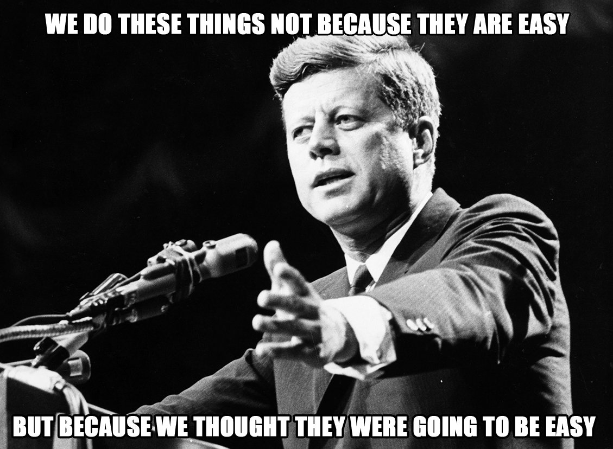

So for the past while I've been trying to follow along with the development of Mojo, but so far I've mostly just followed along with the changelog and written some pretty trivial pieces of code. 
In my last post I said I wanted to try something a bit more substantial, so here goes. 

I was looking at the [Basalt](https://github.com/basalt-org/basalt) project, which tries to build a Machine Learning framework in pure Mojo, and realized that the only images used so far were MNIST, which come in a weird binary format anyway. Why no other though? As Mojo does not yet support accelerators (like GPUs) Imagenet is probably impractical, but it should be fairly quick to train a CNN on something like CIFAR-10 on a CPU these days. The CIFAR-10 dataset is available from the [original source](https://www.cs.toronto.edu/~kriz/cifar.html) as either a pickle archive or some custom binary format. I thought about writing decoders for these, but it might be more useful to write a PNG parser in Mojo, and then use the version of the dataset hosted on [Kaggle](https://www.kaggle.com/c/cifar-10/) and other places, or just transform the original to PNGs using [this package](https://github.com/knjcode/cifar2png). That way the code can be used to open PNG images in general.    


# A PNG parser in (pure-ish) Mojo

Don't mistake this post for a tutorial: read it as someone discovering the gory details of the PNG standard while learning a new language. If you want to read more about the PNG format, the [wikipedia page](https://en.wikipedia.org/wiki/PNG) is pretty helpful as an overview, and the [W3C page](https://www.w3.org/TR/png/) provides a lot of detail. 

For reference, this was written with Mojo `24.3.0`, and as Mojo is still changing pretty fast a lot of what is done below might be outdated. I actually I did basically the entire post in `24.2.1` but `24.3` got released just before I published, but it required only minor changes to make it work in the new version. 

The goal here is not to build a tool to display PNGs, but just to read them into an array (or tensor) that can be used for ML purposes, so I will skip over a lot of the more display oriented details. 

## Reading in the data

To start let's take a test image. This is the test image from the PIL library, which is an image of the OG programmer [Grace Hopper](https://en.wikipedia.org/wiki/Grace_Hopper): 
This is a relatively simple PNG, so it should be a good place to start. 


Now that Mojo has implemented it's version of pathlib in the stdlib, we can actually check if the file exists: 


```python
from pathlib import Path
test_image = Path('../images/png_read_mojo/hopper.png')
print(test_image.exists())
```

    True


We'll also import the image via Python so we can compare if the outputs we get match the Python case. 


```python
from python import Python
var Image = Python.import_module('PIL.Image')
var np = Python.import_module('numpy')
py_array = np.array(Image.open("../images/png_read_mojo/hopper.png"))
```

We're going to read the raw bytes. I would have expected the data to be **unsigned** 8-bit integers, but Mojo reads them as **signed** 8-bit integers. There is however a [proposal to change this](https://github.com/modularml/mojo/pull/2099), so this might change soon. 


```python
with open(test_image, "r") as f:
    file_contents = f.read_bytes()

print(len(file_contents))

```

    30605


## Checking the file header

PNG files have a signature defined in the first 8-bytes, part of which is the letters PNG in ASCII. Well define a little helper function to convert from bytes to String: 


```python
fn bytes_to_string(list: List[Int8]) -> String:
    var word = String("")
    for letter in list:
        word += chr(int(letter[].cast[DType.uint8]()))

    return word

```

To make sure we are actually dealing with a PNG, we can check the bits 1 to 3:


```python
png_signature = file_contents[0:8]
print(bytes_to_string(png_signature[1:4]))

```

    PNG


Yup, it's telling us it is a PNG file. 

## Reading chunks

So now we read the first "chunk", which should be the header. 
Each chunk consists of four parts, the chunk length (4 bytes), the chunk type (4 bytes), the chunk data (however long the first 4 bytes said it was), and a checksum (called the CRC) computed from the data (4 bytes). 

| **Length** | **Chunk type** | **Chunk data** | **CRC** |
|------------|----------------|----------------|---------|
|   4 bytes  |     4 bytes    | _Length_ bytes | 4 bytes |

When reading in data with `read_bytes`, the data comes as a list of signed 8-bit integers, but we would like to interpret the data as 32-bit unsigned integers. Below is a helper function to do so (thanks to [Michael Kowalski
](https://github.com/mikowals)) for the help.


```python
from math.bit import bswap, bitreverse
from testing import assert_true


fn bytes_to_uint32_be(owned list: List[Int8]) raises -> List[UInt32]:
  assert_true(len(list) % 4 == 0, "List[Int8] length must be a multiple of 4 to convert to List[Int32]")
  var result_length = len(list) // 4
  
  # get the data pointer with ownership.
  # This avoids copying and makes sure only one List owns a pointer to the underlying address.
  var ptr_to_int8 = list.steal_data() 
  var ptr_to_uint32 = ptr_to_int8.bitcast[UInt32]()

  var result = List[UInt32]()
  result.data = ptr_to_uint32
  result.capacity = result_length
  result.size = result_length

  # swap the bytes in each UInt32 to convert from big-endian to little-endian
  for i in range(result_length):
    result[i] = bswap(result[i])

  return result
```

## Reading the image header

The firs chunk after the file header should always be the image header, so let's have a look at it: 

Let's see how long the first chunk is: 


```python
read_head = 8
chunk_length = bytes_to_uint32_be(file_contents[read_head:read_head+4])[0]
print(chunk_length)
```

    13


So the first chunk is 13 bytes long. Let's see what type it is: 


```python

chunk_type = file_contents[read_head+4:read_head+8]
print(bytes_to_string(chunk_type))
```

    IHDR


IHDR, which confirms that this chunk is the image header. We can now parse the next 13 bytes of header data to get information about the image: 


```python
start_header = int(read_head+8)
end_header = int(read_head+8+chunk_length)
header_data = file_contents[start_header:end_header]
```

The first two chunks tell us the width and height of the image respectively:


```python
print("Image width: ", bytes_to_uint32_be(header_data[0:4])[0])
print("Image height: ", bytes_to_uint32_be(header_data[4:8])[0])
```

    Image width:  128
    Image height:  128


So our image is 128x128 pixels in size. 

The next bytes tell is  the bit depth of each pixel, color type, compression method, filter method, and whether the image is interlaced or not. 


```python
print("Bit depth: ", int(header_data[8]))
print("Color type: ", int(header_data[9]))
print("Compression method: ", int(header_data[10]))
print("Filter method: ", int(header_data[11]))
print("Interlaced: ", int(header_data[12]))

```

    Bit depth:  8
    Color type:  2
    Compression method:  0
    Filter method:  0
    Interlaced:  0


So the color type is `Truecolor`, so RGB, with a bit depth of 8.

Interesting side note: in the [PIL PngImagePlugin](https://github.com/python-pillow/Pillow/blob/main/src/PIL/PngImagePlugin.py) there is a changelog:
```
# history:
# 1996-05-06 fl   Created (couldn't resist it)
# 1996-12-14 fl   Upgraded, added read and verify support (0.2)
# 1996-12-15 fl   Separate PNG stream parser
# 1996-12-29 fl   Added write support, added getchunks
# 1996-12-30 fl   Eliminated circular references in decoder (0.3)
# 1998-07-12 fl   Read/write 16-bit images as mode I (0.4)
# 2001-02-08 fl   Added transparency support (from Zircon) (0.5)
# 2001-04-16 fl   Don't close data source in "open" method (0.6)
# 2004-02-24 fl   Don't even pretend to support interlaced files (0.7)
# 2004-08-31 fl   Do basic sanity check on chunk identifiers (0.8)
# 2004-09-20 fl   Added PngInfo chunk container
# 2004-12-18 fl   Added DPI read support (based on code by Niki Spahiev)
# 2008-08-13 fl   Added tRNS support for RGB images
# 2009-03-06 fl   Support for preserving ICC profiles (by Florian Hoech)
# 2009-03-08 fl   Added zTXT support (from Lowell Alleman)
# 2009-03-29 fl   Read interlaced PNG files (from Conrado Porto Lopes Gouvua)
```

I like the comment from 2004: `Don't even pretend to support interlaced files` and then interlaced PNG being supported about 13 years after PNG reading was added to PIL. 
I have a feeling I won't be dealing with interlaced files in this post...

The final part of this chunk is the CRC32 value, which is the 32-bit [cyclic redundancy check](https://en.wikipedia.org/wiki/Cyclic_redundancy_check). I don't go into too much details, but it's basically an error-detecting code that's added to detect if the chunk data is corrupt. By checking the provided CRC32 value against one we calculate ourselves we can ensure that the data we are reading is not corrupt. 


```python
start_crc = int(read_head+8+chunk_length)
end_crc = int(start_crc+4)
header_crc = bytes_to_uint32_be(file_contents[start_crc:end_crc])[0]
print("CRC: ", hex(header_crc))
```

    CRC:  0x4c5cf69c


We need a little bit of code to calculate the CRC32 value.   
This is not the most efficient implementation, but it is simple.   
I'll probably do a follow up post where I explain what this does in more detail. 


```python
fn CRC32(owned data: List[SIMD[DType.int8, 1]], value: SIMD[DType.uint32, 1] = 0xffffffff) -> SIMD[DType.uint32, 1]:
    var crc32 = value
    for byte in data:
        crc32 = (bitreverse(byte[]).cast[DType.uint32]() << 24) ^ crc32
        for i in range(8):
            
            if crc32 & 0x80000000 != 0:
                crc32 = (crc32 << 1) ^ 0x04c11db7
            else:
                crc32 = crc32 << 1

    return bitreverse(crc32^0xffffffff)
```


```python
print(hex(CRC32(file_contents[read_head+4:end_header])))
```

    0x4c5cf69c


Great, so the CRC hexes match, so we know that the data in our IHDR chunk is good. 

## Reading more chunks

Now, reading parts of each chunk will get repetitive, so let's define a struct called `Chunk` to hold the information contained in a chunk, and a function that will parse chunks for us and return the constituent parts: 


```python
struct Chunk(Movable, Copyable):
    var length: UInt32
    var type: String
    var data: List[Int8]
    var crc: UInt32
    var end: Int

    fn __init__(inout self, length: UInt32, chunk_type: String, data : List[Int8], crc: UInt32, end: Int):
        self.length = length
        self.type = chunk_type
        self.data = data
        self.crc = crc
        self.end = end

    fn __moveinit__(inout self, owned existing: Chunk):
        self.length = existing.length
        self.type = existing.type
        self.data = existing.data
        self.crc = existing.crc
        self.end = existing.end

    fn __copyinit__(inout self, existing: Chunk):
        self.length = existing.length
        self.type = existing.type
        self.data = existing.data
        self.crc = existing.crc
        self.end = existing.end


def parse_next_chunk(owned data: List[Int8], read_head: Int) -> Chunk:
    chunk_length = bytes_to_uint32_be(data[read_head:read_head+4])[0]
    chunk_type = bytes_to_string(data[read_head+4:read_head+8])
    start_data = int(read_head+8)
    end_data = int(start_data+chunk_length)
    chunk_data = data[start_data:end_data]
    start_crc = int(end_data)
    end_crc = int(start_crc+4)
    chunk_crc = bytes_to_uint32_be(data[start_crc:end_crc])[0]

    # Check CRC
    assert_true(CRC32(data[read_head+4:end_data]) == chunk_crc, "CRC32 does not match")
    return Chunk(length=chunk_length, chunk_type=chunk_type, data=chunk_data, crc=chunk_crc, end=end_crc)

```

During chunk creation the CRC32 value for the chunk data is computed, and an issue will be raised if it is different to what is expected. 

Let's test this to see if it parses the IHDR chunk: 


```python
var header_chunk = parse_next_chunk(file_contents, 8)
print(header_chunk.type)
read_head = header_chunk.end
```

    IHDR


The next few chunks are called "Ancillary chunks", and are not strictly necessary. They contain image attributes (like [gamma](https://en.wikipedia.org/wiki/Gamma_correction)) that may be used in rendering the image: 


```python
var gamma_chunk = parse_next_chunk(file_contents, read_head)
print(gamma_chunk.type)
read_head = gamma_chunk.end
```

    gAMA


```python
var chromacity_chunk = parse_next_chunk(file_contents, read_head)
print(chromacity_chunk.type)
read_head = chromacity_chunk.end
```

    cHRM


```python
var background_chunk = parse_next_chunk(file_contents, read_head)
print(background_chunk.type)
read_head = background_chunk.end
```

    bKGD


```python
var pixel_size_chunk = parse_next_chunk(file_contents, read_head)
print(pixel_size_chunk.type)
read_head = pixel_size_chunk.end
```

    pHYs


## The image data chunk

The IDAT chunk (there can actually be several of them per image) contains the actual image data. 


```python
var image_data_chunk = parse_next_chunk(file_contents, read_head)
print(image_data_chunk.type)
read_head = image_data_chunk.end
```

    IDAT


### Decompression

PNGs are compressed (losslessly) with the [DEFLATE](https://en.wikipedia.org/wiki/Deflate) compression algorithm. 

PNGs are first filtered, then compressed, but as we are decoding, we need to first uncompress the data and the undo the filter.

This next section is why I said in "pure-ish" Mojo: I considered implementing it, but that would be quite a lot of work, so I am hoping that either someone else does this, or that I might dig into this in the future. 

So for the moment, I am using the [zlib](https://en.wikipedia.org/wiki/Zlib) version of the algorithm through Mojo's foreign function interface (FFI).

The following I lightly adapted from the Mojo discord from a thread between Ilya Lubenets and Jack Clayton:


```python
from sys import ffi
alias Bytef = Scalar[DType.int8]
alias uLong = UInt64
alias zlib_type = fn(
    _out: Pointer[Bytef], 
    _out_len: Pointer[UInt64], 
    _in: Pointer[Bytef], 
    _in_len: uLong
) -> Int
fn log_zlib_result(Z_RES: Int, compressing: Bool = True) raises -> NoneType:
    var prefix: String = ''
    if not compressing:
        prefix = "un"

    if Z_RES == 0:
        print('OK ' + prefix.upper() + 'COMPRESSING: Everything ' + prefix + 'compressed fine')
    elif Z_RES == -4:
        raise Error('ERROR ' + prefix.upper() + 'COMPRESSING: Not enought memory')
    elif Z_RES == -5:
        raise Error('ERROR ' + prefix.upper() + 'COMPRESSING: Buffer have not enough memory')
    else:
        raise Error('ERROR ' + prefix.upper() + 'COMPRESSING: Unhandled exception')

fn uncompress(data: List[Int8], quiet: Bool = True) raises -> List[UInt8]:
    var data_memory_amount: Int = len(data)*4
    var handle = ffi.DLHandle('')
    var zlib_uncompress = handle.get_function[zlib_type]('uncompress')

    var uncompressed = Pointer[Bytef].alloc(data_memory_amount)
    var compressed = Pointer[Bytef].alloc(len(data))
    var uncompressed_len = Pointer[uLong].alloc(1)
    memset_zero(uncompressed, data_memory_amount)
    memset_zero(uncompressed_len, 1)
    uncompressed_len[0] = data_memory_amount
    for i in range(len(data)):
        compressed.store(i, data[i])

    var Z_RES = zlib_uncompress(
        uncompressed,
        uncompressed_len,
        compressed,
        len(data),
    )

    if not quiet:
        log_zlib_result(Z_RES, compressing=False)
        print('Uncompressed length: ' + str(uncompressed_len[0]))
    # Can probably do something more efficient here with pointers, but eh. 
    var res = List[UInt8]()
    for i in range(uncompressed_len[0]):
        res.append(uncompressed[i].cast[DType.uint8]())
    return res
```

Drumroll... let's see if this worked:


```python
uncompressed_data = uncompress(image_data_chunk.data, quiet=False)
```

    OK UNCOMPRESSING: Everything uncompressed fine
    Uncompressed length: 49280


Now we have a list of uncompressed bytes. However, these are not pixel values yet. 
The uncompressed data has a length of 49280 bytes. We know we have an RGB image with 8-bit colour depth, so expect $$128 * 128 * 3 = 49152$$ bytes worth of pixel data. Notice that $$49280 - 49152 = 128$$, and that our image has a shape of `(128, 128)`.  
These extra 128 bytes are to let us know what filter was used to transform the byte values each line of pixels (knows as scanlines) into something that can be efficiently compressed.  

### Unfilter

The possible filter types specified by the [PNG specification](https://www.w3.org/TR/PNG-Filters.html) are: 

```
   Type    Name
   
   0       None
   1       Sub
   2       Up
   3       Average
   4       Paeth
```

There is some subtle points to pay attention to in the specification, such as the fact that these filter are applied per byte, and not per pixel value. For 8-bit colour depth this is unimportant, but at 16-bits, this means the first byte of a pixel (the MSB, or most significant byte) will be computed separately from the second byte (the LSB, or least significant byte). I won't go too deep into all the details here, but you can read the details of the specification [here](https://www.w3.org/TR/PNG-Filters.html). 

I'll briefly explain the basic idea behind each filter: 

* 0: None
   * No filter is applied and each byte value is just the raw pixel value. 
* 1: Sub
   * Each byte has the preceding byte value subtracted from it
* 2: Up
   * Each byte has the value of the byte above it subtracted from it. 
* 3: Average: 
   * Each byte has the (floor) of the average of the bytes above and to the left of it subtracted from it. 
* 4: Paeth:
   * The three neighbouring pixels (left, above and upper left) are used to calculate a value that is subtracted from the pixel. It's a little more involved than the other three. 

So when decoding the filtered data, we need to reverse the above operations to regain the pixel values. 


Now that we know that, let's look at our first byte value: 


```python
print(uncompressed_data[0])
```

    1


So we are dealing with filter type 1 here. 
Let's decode the first row:


```python
var filter_type = uncompressed_data[0]
var scanline = uncompressed_data[1:128*3+1]

# Decoded image data
var result = List[UInt8](capacity=128*3)
# take the first pixels as 0
var left: UInt8 = 0
var pixel_size: Int = 3
var offset: Int = 1

for i in range(len(scanline)):
    if i >= pixel_size:
        left = result[i-pixel_size] 

    # The specification specifies that the result is modulo 256
    # Silimar to the C implementation, we can just add the left pixel to the current pixel,
    # and the result will be modulo 256 due to overflow
    result.append((uncompressed_data[i + offset] + left))

```

And let's confirm that the row we decoded is the same as PIL would do: 


```python
for i in range(128):
    for j in range(3):
        assert_true(result[i*3+j] == py_array[0][i][j].__int__(), "Pixel values do not match")
```

Now that we have the general idea of things, let's write this more generally, and do the other filters as well. 

For an idea of how filters are chosen, read this stackoverflow post and the resources it points to: [How do PNG encoders pick which filter to use?](https://stackoverflow.com/questions/59492926/how-do-png-encoders-pick-which-filter-to-use)

I've done these as functions that take 16-bit signed integers. This is important mostly for the case of the Paeth filter, where the standard states: 
> The calculations within the PaethPredictor function must be performed exactly, without overflow. Arithmetic modulo 256 is to be used only for the final step of subtracting the function result from the target byte value.
So basically we need to keep a higher level of precision and then cast back to bytes at the end. 


I based the implementation on the [iPXE](https://ipxe.org/) implementation of a [png decoder](https://dox.ipxe.org/png_8c_source.html) written in C. 


```python
from math import abs

fn undo_trivial(current: Int16, left: Int16 = 0, above: Int16 = 0, above_left: Int16 = 0) -> Int16:
    return current

fn undo_sub(current: Int16, left: Int16 = 0, above: Int16 = 0, above_left: Int16 = 0) -> Int16:
    return current + left

fn undo_up(current: Int16, left: Int16 = 0, above: Int16 = 0, above_left: Int16 = 0) -> Int16:
    return current + above

fn undo_average(current: Int16, left: Int16 = 0, above: Int16 = 0, above_left: Int16 = 0) -> Int16:
    return current + ((above + left) >> 1) # Bitshift is equivalent to division by 2

fn undo_paeth(current: Int16, left: Int16 = 0, above: Int16 = 0, above_left: Int16 = 0) -> Int16:

    var peath: Int16 = left + above - above_left
    var peath_a: Int16 = abs(peath - left)
    var peath_b: Int16 = abs(peath - above)
    var peath_c: Int16 = abs(peath - above_left)
    if ( peath_a <= peath_b ) and ( peath_a <= peath_c ):
        return (current + left)
    elif ( peath_b <= peath_c ): 
        return (current + above)
    else:
        return (current + above_left)

fn undo_filter(filter_type: UInt8, current: UInt8, left: UInt8 = 0, above: UInt8 = 0, above_left: UInt8 = 0) raises -> UInt8:

    var current_int = current.cast[DType.int16]()
    var left_int = left.cast[DType.int16]()
    var above_int = above.cast[DType.int16]()
    var above_left_int = above_left.cast[DType.int16]()
    var result_int: Int16 = 0

    if filter_type == 0:
        result_int= undo_trivial(current_int, left_int, above_int, above_left_int)
    elif filter_type == 1:
        result_int = undo_sub(current_int, left_int, above_int, above_left_int)
    elif filter_type == 2:
        result_int = undo_up(current_int, left_int, above_int, above_left_int)
    elif filter_type == 3:
        result_int = undo_average(current_int, left_int, above_int, above_left_int)
    elif filter_type == 4:
        result_int = undo_paeth(current_int, left_int, above_int, above_left_int)
    else:
        raise Error("Unknown filter type")
    return result_int.cast[DType.uint8]()

```

For the `undo_filter` function, I was trying to add the separate filters to some kind of Tuple or List so I could just index them (hence the uniform signatures), but wasn't able to figure out how to do this in Mojo yet. 

So let's apply these to the whole image and confirm that we have the same results as we would get from Python: 


```python

# Decoded image data
# take the first pixels as 0
var pixel_size: Int = 3

# Initialize the previous scanline to 0
var previous_result = List[UInt8](0*128)

for line in range(128):
    var offset =  1 + 1*line + line * 128 * 3
    var left: UInt8 = 0
    var above_left: UInt8 = 0

    #var left: UInt8 = 0
    var result = List[UInt8](capacity=128*3)
    var scanline = uncompressed_data[offset:offset+128*3]

    var filter_type = uncompressed_data[offset - 1]

    for i in range(len(scanline)):
        if i >= pixel_size:
            left = result[i-pixel_size] 
            above_left = previous_result[i-pixel_size] 

        result.append(undo_filter(filter_type, uncompressed_data[i + offset], left, previous_result[i], above_left))


    previous_result = result
    for i in range(128):
        for j in range(3):
            assert_true(result[i*3+j] == py_array[line][i][j].__int__(), "Pixel values do not match")


    
```

And that's it. If the above runs it means we've sucessfully parsed a PNG file, and at least get the same data out as you would by using Pillow. 


## Creating a tensor

Now ideally we want the above into a Tensor. 

Lets write a function that will parse the image data and return a Tensor for us. 


```python
from tensor import Tensor, TensorSpec, TensorShape
from utils.index import Index
from random import rand

var height = 128
var width = 128
var channels = 3

# Declare the grayscale image.
var spec = TensorSpec(DType.uint8, height, width, channels)
var tensor_image = Tensor[DType.uint8](spec)
```


```python
# Decoded image data
# take the first pixels as 0
var pixel_size: Int = 3

# Initialize the previous scanline to 0
var previous_result = List[UInt8](0*128)

for line in range(128):
    var offset =  1 + 1*line + line * 128 * 3
    var left: UInt8 = 0
    var above_left: UInt8 = 0

    #var left: UInt8 = 0
    var result = List[UInt8](capacity=128*3)
    var scanline = uncompressed_data[offset:offset+128*3]

    var filter_type = uncompressed_data[offset - 1]

    for i in range(len(scanline)):
        if i >= pixel_size:
            left = result[i-pixel_size] 
            above_left = previous_result[i-pixel_size] 

        result.append(undo_filter(filter_type, uncompressed_data[i + offset], left, previous_result[i], above_left))


    previous_result = result
    for i in range(128):
        for j in range(3):
            tensor_image[Index(line, i, j)] = result[i*3+j]
```

I'm not entirely sure why I need to use `Index` while setting items, but when getting I can just provide indices: 


```python
print(tensor_image[0,1,2])
print(py_array[0][1][2])
```

    62
    62


And there we have it. I will put it all together soon but let's finish parsing the file quickly. 

## Final chunks
There are a few more chunks at this point: text chunks which hold some comments, and an end chunk, which denotes the end of the file: 


```python
var text_chunk_1 = parse_next_chunk(file_contents, read_head)
print(text_chunk_1.type)
read_head = text_chunk_1.end
print(bytes_to_string(text_chunk_1.data))
```

    tEXt
    comment


```python
var text_chunk_2 = parse_next_chunk(file_contents, read_head)
print(text_chunk_2.type)
read_head = text_chunk_2.end
print(bytes_to_string(text_chunk_2.data))
```

    tEXt
    date:create


```python
var text_chunk_3 = parse_next_chunk(file_contents, read_head)
print(text_chunk_3.type)
read_head = text_chunk_3.end
print(bytes_to_string(text_chunk_3.data))
```

    tEXt
    date:modify


The text chunks above actually have more info, but seem to be UTF-8 encoded, and Mojo just seems to handle ASCII? 


```python
var end_chunk = parse_next_chunk(file_contents, read_head)
print(end_chunk.type)
read_head = end_chunk.end
```

    IEND


## Putting it all together. 

Let's package the logic above up a bit more nicely. I'm thinking something that resembles PIL. 

Well start with a struct called `PNGImage`


```python

fn bytes_to_hex_string(list: List[Int8]) -> String:
    var word = String("")
    for letter in list:
        word += hex(int(letter[].cast[DType.uint8]()))

    return word


fn determine_file_type(data: List[Int8]) -> String:

    # Is there a better way? Probably
    if bytes_to_hex_string(data[0:8]) == String("0x890x500x4e0x470xd0xa0x1a0xa"):
        return "PNG"
    else:
        return "Unknown"


struct PNGImage:
    var image_path: Path
    var raw_data: List[Int8]
    var width: Int
    var height: Int
    var channels: Int
    var bit_depth: Int
    var color_type: Int
    var compression_method: UInt8
    var filter_method: UInt8
    var interlaced: UInt8
    var data: List[UInt8]
    var data_type: DType

    fn __init__(inout self, file_name: Path) raises:

        self.image_path = file_name
        assert_true(self.image_path.exists(), "File does not exist")

        with open(self.image_path , "r") as image_file:
            self.raw_data = image_file.read_bytes()

        assert_true(determine_file_type(self.raw_data) == "PNG", "File is not a PNG. Only PNGs are supported")

        var read_head = 8

        var header_chunk = parse_next_chunk(self.raw_data, read_head)
        read_head = header_chunk.end

        self.width = int(bytes_to_uint32_be(header_chunk.data[0:4])[0])
        self.height = int(bytes_to_uint32_be(header_chunk.data[4:8])[0])
        self.bit_depth = int(header_chunk.data[8].cast[DType.uint32]())
        self.color_type = int(header_chunk.data[9])
        self.compression_method = header_chunk.data[10].cast[DType.uint8]()
        self.filter_method = header_chunk.data[11].cast[DType.uint8]()
        self.interlaced = header_chunk.data[12].cast[DType.uint8]()

        # There must be a better way to do this
        var color_type_dict = Dict[Int, Int]()
        color_type_dict[0] = 1
        color_type_dict[2] = 3
        color_type_dict[3] = 1
        color_type_dict[4] = 2
        color_type_dict[6] = 4

        self.channels = color_type_dict[self.color_type]

        if self.bit_depth == 8:
            self.data_type = DType.uint8
        elif self.bit_depth == 16:
            self.data_type = DType.uint16
        else:
            raise Error("Unknown bit depth")

        # Check color_type and bit_depth
        assert_true(self.color_type == 2, "Only RGB images are supported")
        assert_true(self.bit_depth == 8, "Only 8-bit images are supported")
        
        # Check if the image is interlaced
        assert_true(self.interlaced == 0, "Interlaced images are not supported")
        # Chack compression method
        assert_true(self.compression_method == 0, "Compression method not supported")


        # Scan over chunks until end found
        var ended = False
        var data_found = False
        var uncompressd_data = List[Int8]() 
        while read_head < len(self.raw_data) and not ended:
            var chunk = parse_next_chunk(self.raw_data, read_head)
            read_head = chunk.end

            if chunk.type == "IDAT":
                uncompressd_data.extend(chunk.data)
                data_found = True
            elif chunk.type == "IEND":
                ended = True

        assert_true(ended, "IEND chunk not found")
        assert_true(data_found, "IDAT chunk not found")
        self.data = uncompress(uncompressd_data)
            


    # In case the filename is passed as a string
    fn __init__(inout self, file_name: String) raises:
        self.__init__(Path(file_name))


    fn to_tensor(self) raises -> Tensor[DType.uint8]:
        var spec = TensorSpec(DType.uint8, self.height, self.width, self.channels)
        var tensor_image = Tensor[DType.uint8](spec)

        var pixel_size: Int = self.channels * (self.bit_depth // 8)

        # Initialize the previous scanline to 0
        var previous_result = List[UInt8](0*self.width)

        for line in range(self.height):
            var offset =  1 + 1*line + line * self.width * pixel_size
            var left: UInt8 = 0
            var above_left: UInt8 = 0

            var result = List[UInt8](capacity=self.width*pixel_size)
            var scanline = self.data[offset:offset+self.width*pixel_size]

            var filter_type = self.data[offset - 1]

            for i in range(len(scanline)):
                if i >= pixel_size:
                    left = result[i-pixel_size] 
                    above_left = previous_result[i-pixel_size] 

                result.append(undo_filter(filter_type, self.data[i + offset], left, previous_result[i], above_left))

            previous_result = result
            for i in range(self.width):
                for j in range(self.channels):
                    tensor_image[Index(line, i, j)] = result[i*self.channels+j]


        return tensor_image
```

Well, it's not the prettiest, but let's see if it works: 


```python
var hopper = PNGImage(test_image)
hopper_tensor = hopper.to_tensor()

for i in range(hopper.height):
    for j in range(hopper.width):
        for c in range(hopper.channels):
            assert_true(hopper_tensor[i, j, c] == py_array[i][j][c].__int__(), "Pixel values do not match")
```

If the above runs, then it means we read the image correctly!

Let's try on a PNG image from the CIFAR-10 dataset: 


```python
cifar_image = Path('../images/png_read_mojo/114_automobile.png')
var cifar = PNGImage(cifar_image)
cifar_tensor = cifar.to_tensor()

py_cifar = np.array(Image.open('../images/png_read_mojo/114_automobile.png'))

for i in range(cifar.height):
    for j in range(cifar.width):
        for c in range(cifar.channels):
            assert_true(cifar_tensor[i, j, c] == py_cifar[i][j][c].__int__(), "Pixel values do not match")
```

This also works! Now we should be able to read the CIFAR-10 dataset! 

I have a few questions about my implementation above, i.e: 
* How to handle 16-bit images? Do we need a separate function, i.e. `to_tensor_16`?
* Is a struct the correct way to do this?   

This is one of those points where I don't feel I know what the idiomatic way to do this in Mojo is yet. The 🪄Mojical🪄 way, you might say 😉. Mojo is so young that I'm not sure an idiomatic way has emerged yet. 

## Conclusions

Reading PNGs was quite a fun topic for a blog post. It made me really get my hands dirty with some of the more low level concepts in Mojo, something I felt I didn't fully grasp before. 

I'll admit, this ended up being a bit more work than I expected. To paraphrase JFK:   




It's impressive how far Mojo has come in just a few months: when I was trying to write a bit of Mojo in September of last year it felt hard to do anything practical, while now the language seems to be quite usable. 

There are still a few things I need to get used to. One thing is I always feel like I "need" to write `fn` functions, and not `def` functions. This is good practice when writing libraries and such, but it makes me wonder: when is writing `def` style functions appropriate, as `fn` will always be safer and more performant? 


## Addendum

I refactored the code from this blog post a bit and wrote it up into a library I am calling [Mimage](https://github.com/fnands/mimage). The goal would be to be able to read and write common image formats in pure Mojo without having to resort to calling Python or C. Currently Mimage still requires some C libraries for the uncompress step, but I am hoping that those will be available in pure Mojo soon. 

The next steps will likely be adding support to Mimage for 16-bit PNGs and JPEGs. The long term goal would be to be able to read and write all the same image formats as Python's [Pillow](https://github.com/python-pillow/Pillow), but that will likely take a long time to reach. As I am on the ML side of things, I'll try and focus on the formats and functionality needed for ML purposes, like being able to read all the images in the Imagenet dataset. 


